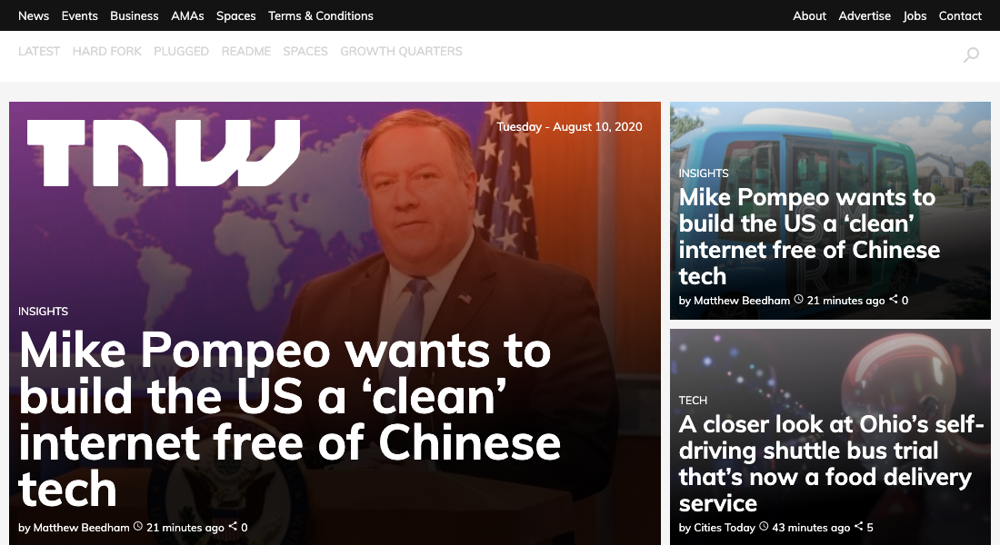

# The Next Web Clone

> A clone of The Next Web website practicing the principles of responsiveness using media queries

The project focusses on creating a clone of The Next Web website to practice knowledge of responsiveness. The following features were implemented and different views at various breakpoints:

- Navbar
- Featured articles / headliners
- Latest news section
- Latest funds rounds
- Categories
- Latest Deals
- Footer

## Built With

- HTML,
- CSS3

## Live Demo

[Live Demo Link](https://raw.githack.com/oracleot/the-next-web-clone/responsive-feature/index.html)

## Authors

👤 **Author1**

- [@oracleot](https://github.com/oracleot)

👤 **Author2**

- [@ggotora](https://github.com/ggotora)

## 🤝 Contributing

Contributions, issues and feature requests are welcome!

Feel free to check the [issues page](issues/).

## 📝 License

This project is [MIT](lic.url) licensed.
